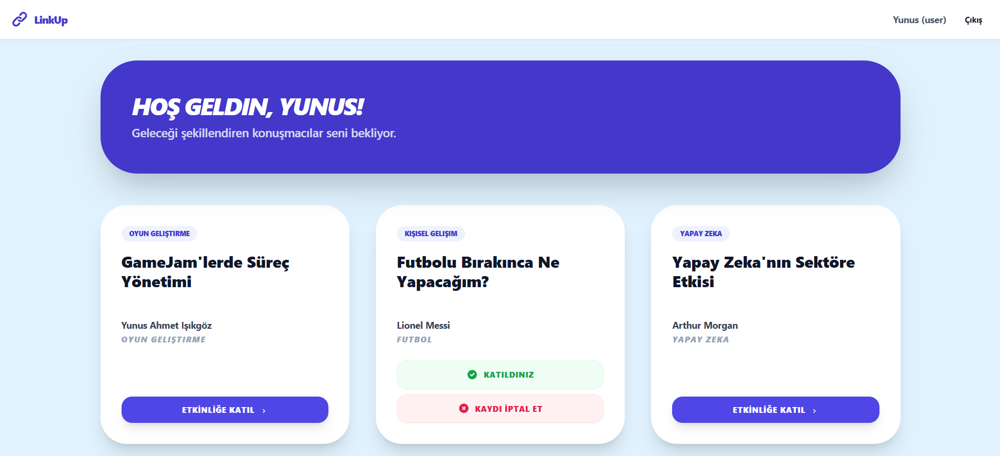
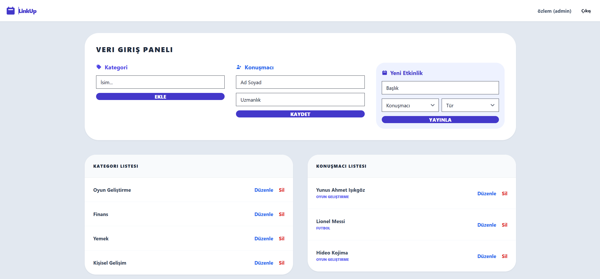

# 🚀 LinkUp - Full-Stack Event Management Platform
# 📝 About the Project
LinkUp is a centralized digital platform designed to manage institutional or public events effectively. The project is built with a Full-Stack architecture, implementing Role-Based Access Control (RBAC) to distinguish between Admin and Participant functionalities.

Admin Role: Fully coordinates the event ecosystem, including categories, speakers, and content.

Participant Role: Enables users to discover events and manage their registrations with a single click.

## 📸 App Screenshots

### 📅 Participant Role

### 📊 Management Dashboard

# 🛠️ Tech Stack
The project utilizes modern software engineering principles to ensure scalability and security:

* Frontend (UI): Built with React 18 for a component-based architecture.

* Styling: Tailwind CSS and Flowbite React components were used for a responsive and modern user experience.

* Backend (Server): Developed using NestJS (TypeScript) for a modular and secure API layer.

* Database: SQLite is used as the data storage unit.

* ORM: TypeORM manages database interactions and minimizes security risks like SQL injection.

# ✨ Key Features
👤 User Roles & Management

* Dual-Role System: Dynamically renders different interfaces based on whether the user is an Admin or a Participant.

* Secure Authentication: Implements JWT (JSON Web Token) for session management and secure access.

* Input Validation: Features strict password complexity (Regex) and email format checks during registration to prevent "dirty data".

📅 Event Orchestration

* Admin Dashboard: Provides full authority to coordinate categories, speakers, and event content.

* Event Discovery: Allows participants to browse events through specialized cards displaying category, title, and speaker information.

* One-Click Attendance: A seamless "Join/Leave" mechanism that manipulates the connection between users and events in real-time.

📊 Database Architecture (3NF)

* The system maintains data integrity through a design compliant with 3rd Normal Form (3NF) standards:

* User Entity: Stores authentication credentials and role-based permissions.

* AppEvent Entity: Holds core event details like title, date, and location.

* Speaker & Category Entities: Maintain specialized data for experts and event classification (e.g., "Game Development", "AI").

* Attendance (Junction Table): A critical intermediary table managing the Many-to-Many relationship between Users and Events using Foreign Keys.

# 🔒 Security Implementation

* Password Hashing: Utilizes Bcrypt for salting and hashing passwords before database insertion to ensure data privacy.

* Data Integrity: Employs Foreign Key constraints such as SET NULL or ON DELETE CASCADE to prevent errors during data deletion.

* Authentication Guards: Protects sensitive API endpoints to ensure only authorized administrators can modify the system.
